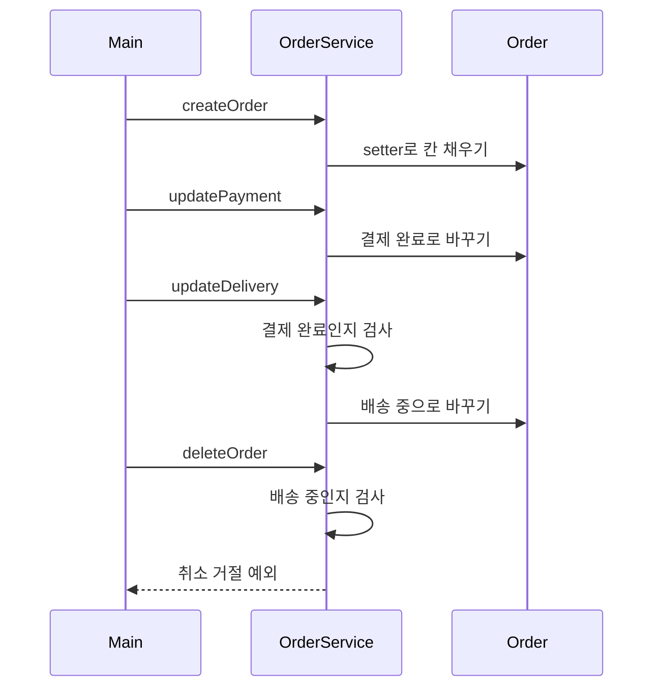

# anemic-order 흐름

```mermaid
sequenceDiagram
  participant M as Main
  participant S as OrderService
  participant O as Order
  M->>S: createOrder
  S->>O: setter로 칸 채우기
  M->>S: updatePayment
  S->>O: 결제 완료로 바꾸기
  M->>S: updateDelivery
  S->>S: 결제 완료인지 검사
  S->>O: 배송 중으로 바꾸기
  M->>S: deleteOrder
  S->>S: 배송 중인지 검사
  S-->>M: 취소 거절 예외
```

규칙 검사는 모두 OrderService에 있다. Order는 칸과 getter, setter만 있다.
