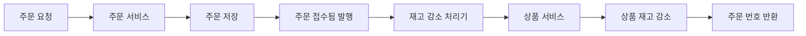

# bounded-contexts 흐름

```mermaid
flowchart LR
  A[주문 요청] --> B[주문 서비스]
  B --> C[주문 저장]
  C --> D[주문 접수됨 발행]
  D --> E[재고 감소 처리기]
  E --> F[상품 서비스]
  F --> G[상품 재고 감소]
  G --> H[주문 번호 반환]
```

회원 서비스는 회원 조회와 목록 조회를, 상품 서비스는 상품 조회와 목록 조회, 재고 감소를 맡는다.
발행기부터 처리기까지 같은 스레드에서 즉시 호출한다.
동기 호출만으로 주문 저장과 상품 저장이 하나의 트랜잭션이 되지는 않는다.
