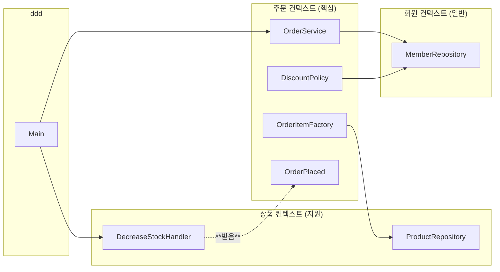

# bounded-contexts 흐름

```mermaid
flowchart LR
  subgraph main [ddd]
    M[Main]
  end
  subgraph order ["주문 컨텍스트 (핵심)"]
    S[OrderService]
    F[OrderItemFactory]
    P[DiscountPolicy]
    E[OrderPlaced]
  end
  subgraph catalog ["상품 컨텍스트 (지원)"]
    H[DecreaseStockHandler]
    R[ProductRepository]
  end
  subgraph member ["회원 컨텍스트 (일반)"]
    B[MemberRepository]
  end
  M --> S
  M --> H
  F --> R
  P --> B
  S --> B
  H -. **받음** .-> E
```

화살표는 가져다 쓰는 방향이다. 주문 컨텍스트의 주문 항목 팩토리는 상품 저장소를 읽고, 할인 정책과 주문 응용 서비스는 회원을 읽는다. 상품 컨텍스트의 재고 줄이기 처리기는 주문 접수됨 이벤트를 받는다. 컨텍스트마다 안은 layers 장의 계층 그대로이고, 컨텍스트를 잇는 곳은 지금처럼 Main 한 곳이다.
