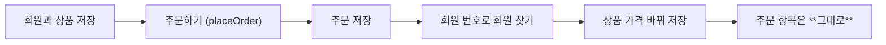
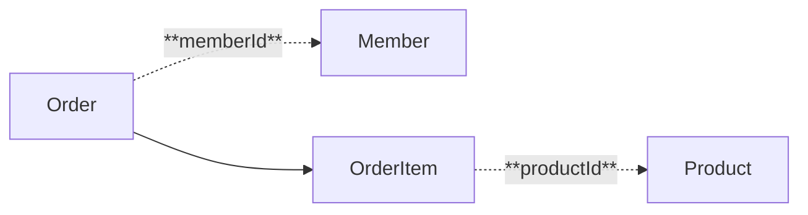

# id-reference 흐름

```mermaid
flowchart LR
  A[회원과 상품 저장] --> B["주문하기 (placeOrder)"]
  B --> C[주문 저장]
  C --> D[회원 번호로 회원 찾기]
  D --> E[상품 가격 바꿔 저장]
  E --> F[주문 항목은 **그대로**]
```

```mermaid
flowchart LR
  O[Order] -. **memberId** .-> M[Member]
  L[OrderItem] -. **productId** .-> P[Product]
  O --> L
```

위 그림은 Main 장면의 순서다. 아래 그림은 애그리거트 사이를 잇는 방법이다. 주문은 회원과 상품을 객체로 갖지 않고 번호로만 가리킨다. 점선은 번호로 가리킨다는 뜻이고, 회원과 상품은 각자 저장소에서 따로 꺼낸다. 주문 항목은 주문 때의 상품 이름과 가격을 담아 두어 상품 가격이 바뀌어도 그대로다.
