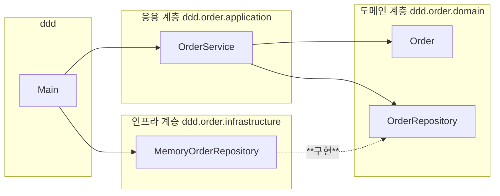

# layers 흐름

```mermaid
flowchart LR
  subgraph main [ddd]
    M[Main]
  end
  subgraph application [응용 계층 ddd.order.application]
    S[OrderService]
  end
  subgraph infrastructure [인프라 계층 ddd.order.infrastructure]
    R[MemoryOrderRepository]
  end
  subgraph domain [도메인 계층 ddd.order.domain]
    O[Order]
    I[OrderRepository]
  end
  M --> S
  M --> R
  S --> O
  S --> I
  R -. **구현** .-> I
```

화살표는 가져다 쓰는 방향이다. 응용 계층과 인프라 계층이 모두 도메인 계층을 향하고, 도메인 계층은 다른 계층을 가져다 쓰지 않는다. 메모리 주문 저장소를 주문 응용 서비스에 넣어 셋을 잇는 곳은 Main 한 곳이다.
