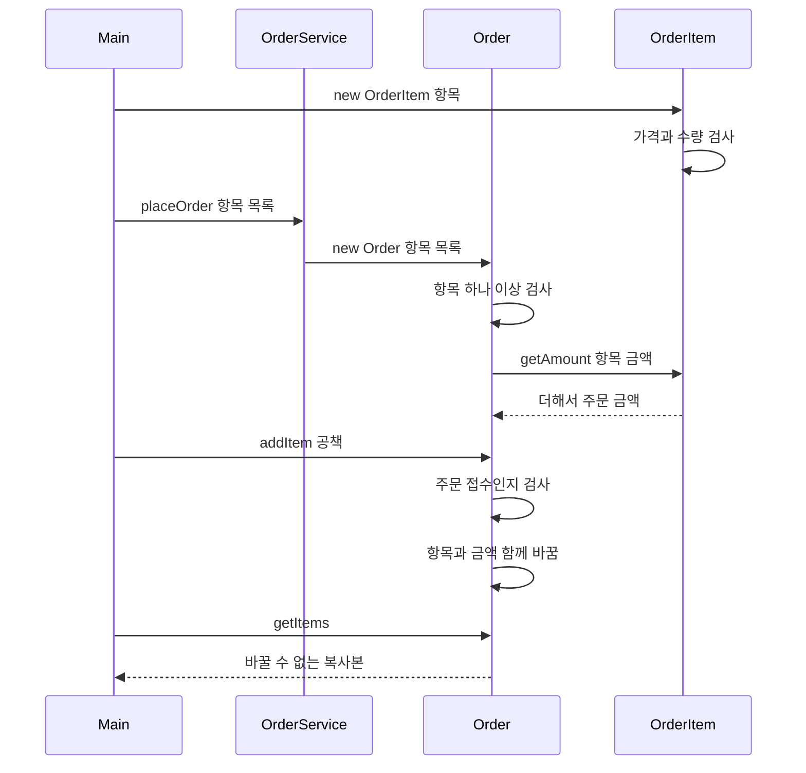

# order-aggregate 흐름

```mermaid
sequenceDiagram
  participant M as Main
  participant S as OrderService
  participant O as Order
  participant I as OrderItem
  M->>I: new OrderItem 항목
  I->>I: 가격과 수량 검사
  M->>S: placeOrder 항목 목록
  S->>O: new Order 항목 목록
  O->>O: 항목 하나 이상 검사
  O->>I: getAmount 항목 금액
  I-->>O: 더해서 주문 금액
  M->>O: addItem 공책
  O->>O: 주문 접수인지 검사
  O->>O: 항목과 금액 함께 바꿈
  M->>O: getItems
  O-->>M: 바꿀 수 없는 복사본
```

주문이 애그리거트의 루트다. 항목은 주문을 거쳐서만 더해지고, 주문 금액과 항목은 늘 함께 맞는다.
