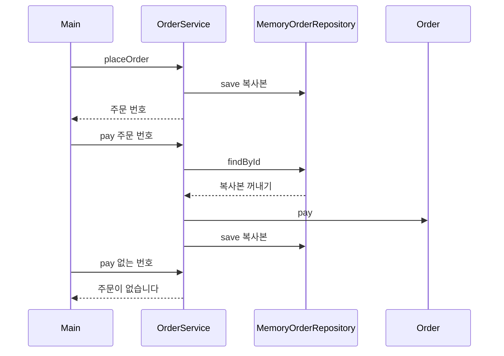

# order-repository 흐름

```mermaid
sequenceDiagram
  participant M as Main
  participant S as OrderService
  participant R as MemoryOrderRepository
  participant O as Order
  M->>S: placeOrder
  S->>R: save 복사본
  S-->>M: 주문 번호
  M->>S: pay 주문 번호
  S->>R: findById
  R-->>S: 복사본 꺼내기
  S->>O: pay
  S->>R: save 복사본
  M->>S: pay 없는 번호
  S-->>M: 주문이 없습니다
```

서비스는 OrderRepository 인터페이스만 안다. 저장소는 new Order(order) 복사본을 쓰므로 꺼낸 주문을 바꾼 뒤 save를 해야 바뀐 것이 남는다.
