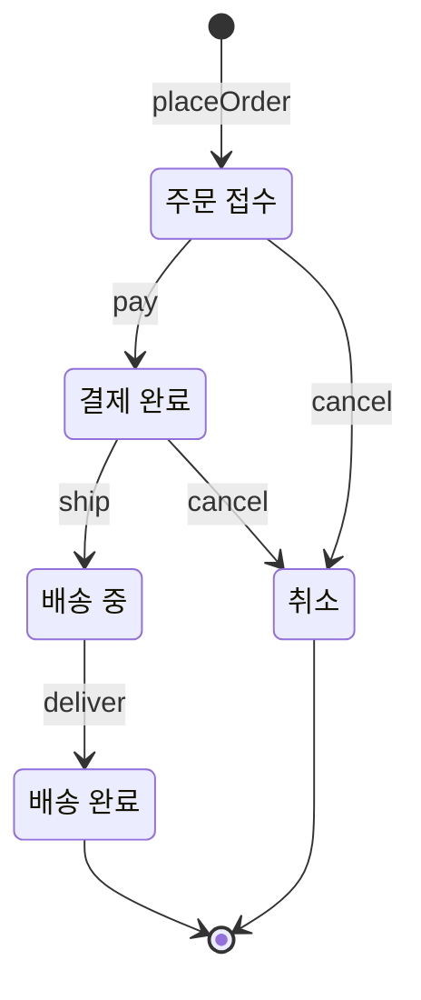

# order-status 흐름

```mermaid
stateDiagram-v2
  ORDERED : 주문 접수
  PAID : 결제 완료
  SHIPPING : 배송 중
  DELIVERED : 배송 완료
  CANCELED : 취소
  [*] --> ORDERED : placeOrder
  ORDERED --> PAID : pay
  ORDERED --> CANCELED : cancel
  PAID --> SHIPPING : ship
  PAID --> CANCELED : cancel
  SHIPPING --> DELIVERED : deliver
  DELIVERED --> [*]
  CANCELED --> [*]
```

화살표가 Order의 pay, ship, deliver, cancel이 지금 상태를 보고 허락하는 길이다. 그 밖의 길은 지금 상태를 넣은 말로 거절한다.
