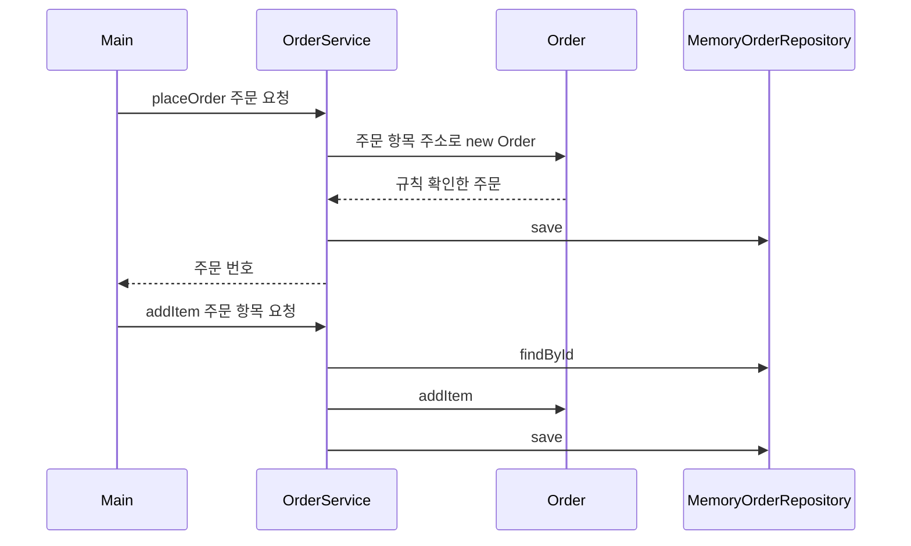

# place-order 흐름

```mermaid
sequenceDiagram
  participant M as Main
  participant S as OrderService
  participant O as Order
  participant R as MemoryOrderRepository
  M->>S: placeOrder 주문 요청
  S->>O: 주문 항목 주소로 new Order
  O-->>S: 규칙 확인한 주문
  S->>R: save
  S-->>M: 주문 번호
  M->>S: addItem 주문 항목 요청
  S->>R: findById
  S->>O: addItem
  S->>R: save
```

응용 서비스는 요청을 주문 항목과 주소로 바꾸고, 꺼내고, 주문에게 시키고, 저장하기만 한다. 가격, 수량, 주소, 상태 규칙은 주문 쪽이 거절한다.
