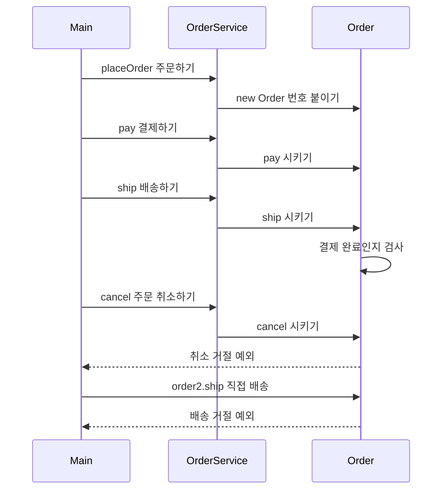

# rich-entity 흐름

```mermaid
sequenceDiagram
  participant M as Main
  participant S as OrderService
  participant O as Order
  M->>S: placeOrder 주문하기
  S->>O: new Order 번호 붙이기
  M->>S: pay 결제하기
  S->>O: pay 시키기
  M->>S: ship 배송하기
  S->>O: ship 시키기
  O->>O: 결제 완료인지 검사
  M->>S: cancel 주문 취소하기
  S->>O: cancel 시키기
  O-->>M: 취소 거절 예외
  M->>O: order2.ship 직접 배송
  O-->>M: 배송 거절 예외
```

규칙 검사가 OrderService에서 Order로 옮겨 갔다. 서비스를 거치지 않고 주문에게 직접 시켜도 주문이 거절한다.
