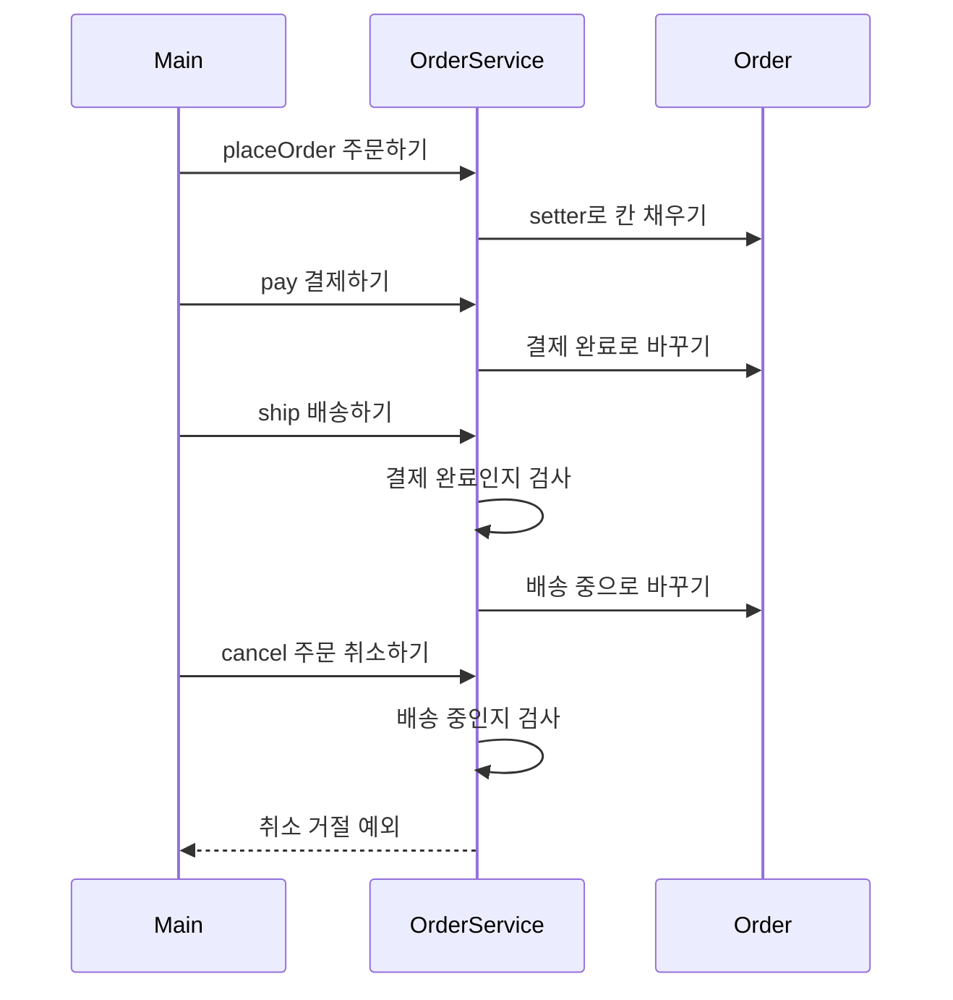

# ubiquitous-language 흐름

```mermaid
sequenceDiagram
  participant M as Main
  participant S as OrderService
  participant O as Order
  M->>S: placeOrder 주문하기
  S->>O: setter로 칸 채우기
  M->>S: pay 결제하기
  S->>O: 결제 완료로 바꾸기
  M->>S: ship 배송하기
  S->>S: 결제 완료인지 검사
  S->>O: 배송 중으로 바꾸기
  M->>S: cancel 주문 취소하기
  S->>S: 배송 중인지 검사
  S-->>M: 취소 거절 예외
```

흐름은 앞 장과 같고 메서드 이름만 업무 말로 바뀌었다. 규칙 검사는 여전히 OrderService에 있다.
