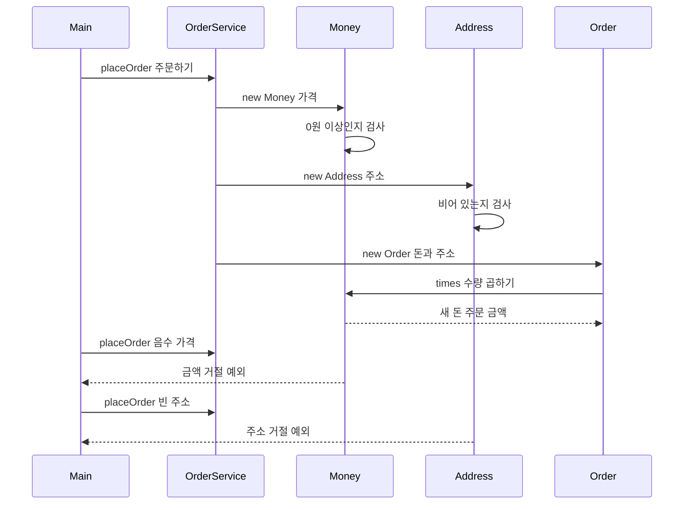

# value-object 흐름

```mermaid
sequenceDiagram
  participant M as Main
  participant S as OrderService
  participant Y as Money
  participant A as Address
  participant O as Order
  M->>S: placeOrder 주문하기
  S->>Y: new Money 가격
  Y->>Y: 0원 이상인지 검사
  S->>A: new Address 주소
  A->>A: 비어 있는지 검사
  S->>O: new Order 돈과 주소
  O->>Y: times 수량 곱하기
  Y-->>O: 새 돈 주문 금액
  M->>S: placeOrder 음수 가격
  Y-->>M: 금액 거절 예외
  M->>S: placeOrder 빈 주소
  A-->>M: 주소 거절 예외
```

금액 검사는 Money가, 주소 검사는 Address가 한다. 주문은 검사를 마친 값만 받는다.
