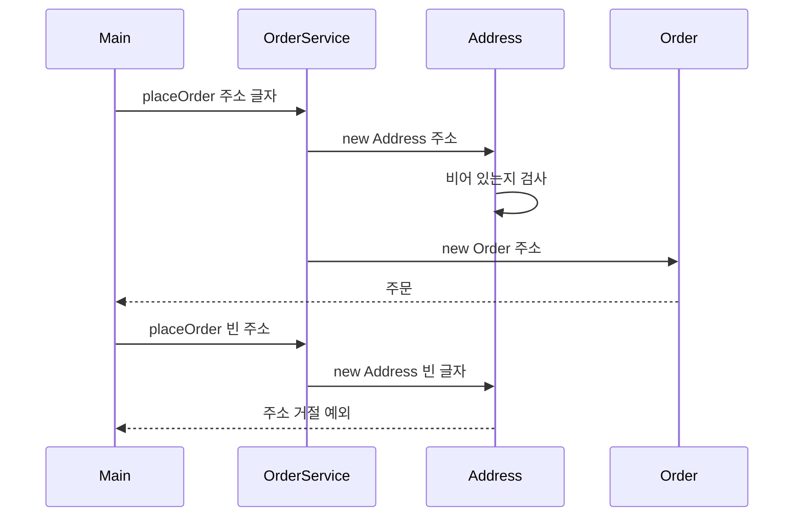

# value-object 흐름

```mermaid
sequenceDiagram
  participant M as Main
  participant S as OrderService
  participant A as Address
  participant O as Order
  M->>S: placeOrder 주소 글자
  S->>A: new Address 주소
  A->>A: 비어 있는지 검사
  S->>O: new Order 주소
  O-->>M: 주문
  M->>S: placeOrder 빈 주소
  S->>A: new Address 빈 글자
  A-->>M: 주소 거절 예외
```

주소 검사는 Address가 한다. 주문은 검사를 마친 주소만 받는다.
