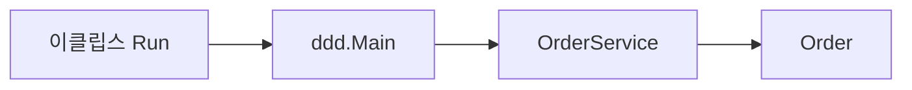

# 시나리오별 구조도

## 주문부터 취소까지

```mermaid
flowchart LR
  A[이클립스 Run] --> B[ddd.Main]
  B --> C[OrderService]
  C --> D[Order]
```

만든 장: project-setup, anemic-order, ubiquitous-language
맡는 파일
- ddd/src/ddd/Main.java
- ddd/src/ddd/OrderService.java
- ddd/src/ddd/Order.java
- ddd/glossary.md
